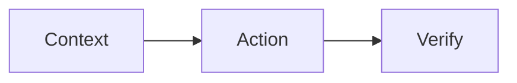

# Content Contract (v1)

Status: Adopted for Phase 1 (2026-08-24)

This document finalizes the shared authoring contract described in
`WRITING-ARCHITECTURE-PLAN.md` §5 and §9. It is the normative reference for
canonical Markdown content in book repositories and blog-only content in the
personal-site repository. The audit tool described at the end of this document
checks these rules read-only.

## 1. Metadata (Frontmatter)

### Required fields

Every canonical Markdown file carries YAML frontmatter:

```yaml
---
id: agent-loop
locale: zh-CN
title: Agent Loop
status: draft
created: 2026-08-24
updated: 2026-08-24
tags:
  - agents
---
```

| Field | Rule |
| --- | --- |
| `id` | Stable logical content ID. Lowercase kebab-case: `^[a-z0-9]+(-[a-z0-9]+)*$`. Never changes when a file moves or a route changes. Translation pairs share the same `id`. |
| `locale` | BCP-47-style language tag. Allowed values for now: `en`, `zh-CN`. Content without a translation still declares its single locale. |
| `title` | Human-readable title for this locale. |
| `status` | One of `draft`, `published`, `archived`. |
| `created` | `YYYY-MM-DD` first publication or creation date. |
| `updated` | `YYYY-MM-DD` last meaningful edit date. Must be >= `created`. |
| `tags` | Optional list of short strings. |

### Invariants

- A repository contains **at most one canonical file per (`id`, `locale`) pair**.
- `id` is stable across moves and route changes.
- Publication-specific fields (route, part, order, layout, publish date,
  excerpt mode) do **not** live in canonical frontmatter. They are derived from
  collection manifests (section 3).
- Renderer-specific frontmatter (Hexo `permalink`, VitePress `sidebar`, etc.)
  is allowed in addition to the required fields but is not portable and must
  not be relied on by the aggregator.

### Locale pairing

- Bilingual content = two files with the same `id`, differing `locale`.
- Single-language content = one file with one `locale`. Fully supported.
- Locale may be implied by directory layout (`book/en/...`) or by filename
  (`zh-CN.md`); the contract reads it from frontmatter only. No physical path
  normalization is required.

## 2. Markdown

- CommonMark and GitHub Flavored Markdown conventions.
- Fenced code blocks must include a language when known:
  ```` ```javascript ````, not a bare ```` ``` ````.
- Renderer-specific tags (``, custom Hexo/theme tags) must not be
  added to canonical content. Existing legacy tags are reported by the audit
  and converted later, never silently.
- Existing raw HTML may remain temporarily where no portable Markdown
  equivalent exists; new content avoids it.

## 3. Mermaid

Use fenced Mermaid blocks only:

````markdown

````

- No Hexo-specific `` tags in canonical content.
- Mermaid *syntax* validation is not part of the Phase 1 audit; it is added to
  CI in Phase 5.

## 4. Images

- Store assets beside the logical content unit under `./assets/`.
- Reference assets with standard relative Markdown paths:

  ```markdown
  
  ```

- Relative references may not escape the repository (`../` crossing repo root)
  and may not point into another repository.
- Site-absolute references (`/images/...`) are renderer-dependent (Hexo
  `source_dir`, VitePress `base`). They are permitted where a renderer
  requires them but are reported by the audit; new content should prefer
  the portable `./assets/...` form.
- Use meaningful alt text.
- Avoid unstable hotlinked images. Remote references (`https://...`) are
  allowed but reported as informational by the audit. Locally owned images
  must retain source and license information where applicable.

## 5. Math

- Inline math: `$...$`
- Display math: `$$...$$`

Renderers may use KaTeX or MathJax; source notation stays the same.

## 6. Internal Links

Adopted syntax (finalized from the plan's candidate):

```markdown
[Context engineering](content:context-engineering)
```

- The target after `content:` is a logical content `id` (same charset as §1).
- It is **not** a filesystem path into another repository.
- Resolution order at build time: current repository index first, then the
  aggregation index built from all pinned sources. Adapters resolve the ID to
  the correct URL for the current book or personal-site surface.
- CI fails on unresolved IDs. The Phase 1 audit already fails unresolved IDs
  across the scanned corpus.

## 7. Collection Manifests

Two manifest kinds live in a book repository under `collections/`:

### `collections/book.yml` — book navigation and publication

```yaml
id: coding-with-agents
items:
  - id: how-agents-work
    source:
      en: book/en/02-anatomy/how-agents-work.md
      zh-CN: book/zh-cn/02-anatomy/how-agents-work.md
    part: anatomy
    order: 2.1
    route: /02-anatomy/how-agents-work/
    layout: agents-chapter
```

Fields:

| Field | Required | Meaning |
| --- | --- | --- |
| `id` | yes | Manifest identifier (book id). |
| `items[].id` | yes | Logical content ID; must match the frontmatter `id` of the referenced files. |
| `items[].source` | one of `source`/`content` | Locale-to-path map (`en:`, `zh-CN:`). Paths are repository-relative to the manifest's repository. This is the existing-path form, adopted first. |
| `items[].content` | one of `source`/`content` | New-layout shorthand: a directory name under `content/` holding `en.md`, `zh-CN.md`, `assets/`. |
| `items[].part` | no | Section label for navigation. |
| `items[].order` | no | Sort key (number or dotted number). |
| `items[].route` | no | Public route on the book site. When absent it is derived, but existing routes must be recorded explicitly. |
| `items[].layout` | no | Renderer-specific layout choice. Keeps layout out of prose. |

### `collections/series.yml` — what may appear on the personal site

```yaml
id: agentic-engineering
items:
  - id: agent-loop
    source:
      en: book/en/02-anatomy/how-agents-work.md
    published_at: 2026-08-24
    mode: excerpt
```

| Field | Required | Meaning |
| --- | --- | --- |
| `id` | yes | Series identifier. |
| `items[].id` | yes | Logical content ID (same as `book.yml` when the item is in both). |
| `items[].source` / `items[].content` | yes (one of) | Same forms as `book.yml`. |
| `items[].published_at` | yes | `YYYY-MM-DD` publication date on the personal site. |
| `items[].mode` | yes | `link` \| `excerpt` \| `full` (default `excerpt`). |
| `items[].book_url` | no | Where the canonical book surface hosts the item: either a single URL string or a locale map (`en:`/`zh-CN:`). The personal site links here for `link`/`excerpt` modes and emits canonical metadata for `full` mode. |

Publication modes (plan §8):

| Mode | Personal-site behavior |
| --- | --- |
| `link` | Title and summary link to the book. |
| `excerpt` | Site renders a summary/introduction, then links to the book. Default. |
| `full` | Site renders the complete Markdown body; one URL must be canonical and the other surface emits canonical metadata. |

### Worked examples for existing repository paths

`Coding-with-Agents` keeps `book/en` and `book/zh-cn`:

```yaml
id: coding-with-agents
items:
  - id: how-agents-work
    source:
      en: book/en/02-anatomy/how-agents-work.md
      zh-CN: book/zh-cn/02-anatomy/how-agents-work.md
    part: anatomy
    order: 2.1
    route: /02-anatomy/how-agents-work/
```

`ComputerScience` keeps `en/book` and `zh/book`:

```yaml
id: computer-science
items:
  - id: git-basics
    source:
      en: en/book/01-foundations/01-environment-and-tools/git/git.md
      zh: zh/book/01-foundations/01-environment-and-tools/git/git.md
    part: foundations
    order: 1.1
```

`Coding-Interview-Questions` keeps `problems/` and `book/` (structure is part
of the product model and long-running history):

```yaml
id: coding-interview-questions
items:
  - id: binary-search
    source:
      en: problems/binary-search/README.md
    order: 2
    layout: problem
```

`MachineLearning` keeps `book/src` as its source root:

```yaml
id: machine-learning
items:
  - id: linear-algebra
    source:
      en: book/src/02-linear-algebra/README.md
    part: foundations
    order: 2
```

The aggregator always reads the manifest; it never assumes a fixed directory
layout.

## 8. Manifest Validation Rules

- Every `items[].id` resolves to an existing canonical file in the same
  repository for every declared locale.
- The frontmatter `id` of a referenced file must equal `items[].id`.
- No duplicate `items[].id` within one manifest.
- `mode` values are limited to `link`, `excerpt`, `full`.
- A content unit may appear in `book.yml`, `series.yml`, both, or neither.
- Duplicate collection membership where prohibited (same `(id, locale)` in two
  repositories' manifests) is reported.
- Manifest files themselves are YAML; parse errors fail the audit.

## 9. Audit Tool

`tools/audit-content.mjs` in the personal-site repository is the Phase 1
read-only audit. Usage:

```bash
node tools/audit-content.mjs [--repos dir1,dir2,...] [--json out.json] [--exclude glob,...]
```

- Walks the given repositories (default: the five sibling repositories in the
  current layout), collecting `*.md` files while skipping generated and
  documentation directories (`node_modules`, `public`, `.deploy_git`, `_book`,
  `dist`, `cache`, `.git`, `.vitepress`, `tmp`, `docs`).
- Reports violations per rule with repository-relative file paths.
- Output is deterministic: results sorted by `(repo, path, rule, detail)` and
  no machine-dependent values (no absolute paths, no timestamps) appear in the
  report.
- Never writes to any scanned file or repository.

Rule IDs:

| ID | Severity | Check |
| --- | --- | --- |
| `meta-missing-frontmatter` | info | File has no YAML frontmatter (e.g. drafts). |
| `meta-missing-field` | error | Required field missing (`id`, `locale`, `title`, `status`, `created`, `updated`). |
| `meta-id-format` | error | `id` does not match `^[a-z0-9]+(-[a-z0-9]+)*$`. |
| `meta-locale-unknown` | error | `locale` not in the allowed set. |
| `meta-status-unknown` | error | `status` not `draft`/`published`/`archived`. |
| `meta-date-format` | error | `created`/`updated` not `YYYY-MM-DD`. |
| `meta-date-order` | error | `updated` < `created`. |
| `meta-duplicate-id-locale` | error | Two canonical files in one repo share (`id`, `locale`). |
| `link-content-unresolved` | error | `content:` target id not found in the scanned corpus. |
| `link-content-malformed` | error | `content:` target fails the id charset. |
| `image-missing` | error | Relative image reference has no file on disk. |
| `image-cross-repo` | error | Relative image reference escapes the repository root. |
| `image-absolute` | info | Site-absolute reference (`/images/...`). Renderer-dependent; existence is not checked. The portable form is `./assets/...`. |
| `image-remote` | info | Remote (`https://`) image reference. |
| `mermaid-legacy-tag` | warning | Hexo `` tag found in canonical content. |
| `code-fence-no-language` | warning | Fenced code block without a language. |
| `manifest-*` | error | Manifest YAML/field violations (section 8). |

The audit is the deterministic Phase 1 baseline. Individual repositories adopt
their own copies as required CI checks in Phase 5.
