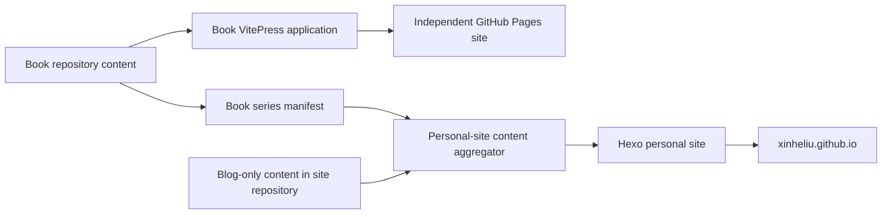
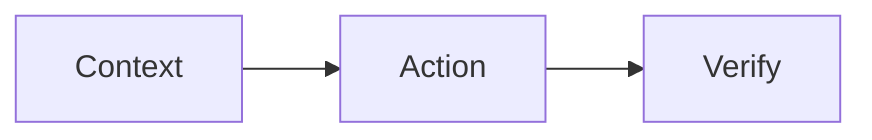

# Writing Architecture Plan

Last updated: 2026-08-24

Status: In implementation — Phase 0 in progress (see Progress Board below)

## Progress Board

This section is the living draft board. Check items off as implementation completes.

### Phase 0 — Repository Recovery and Baseline

- [x] Repair the broken `site-source` Git worktree reference (`git worktree repair`; worktree now resolves at `/Users/xhl/GitHub/writing/site-source` on `source` @ 2faf5b9).
- [x] Fetch and verify the remotely available `MachineLearning` `master` object (HEAD cdbe199 verified; stale dependabot remote-tracking refs repaired).
- [x] Identify canonical source directories and generated output directories (see `docs/architecture/PHASE-0-BASELINE.md`).
- [x] Record current public URLs for the personal site and all books (5 roots verified HTTP 200; route inventory in `docs/architecture/PHASE-0-BASELINE.md`).
- [x] Establish clean production-build baselines (Hexo ✓, Honkit ✓, CIQ VitePress ✓, ML mdBook ✓; ComputerScience VitePress render ✓ but `validate-book.mjs` gate ✗ — see baseline file).
- [x] Preserve all current uncommitted work without committing, stashing, or discarding it (inventory in `docs/architecture/PHASE-0-BASELINE.md`).
- [x] Choose the tracked canonical location for this plan (`site-source/docs/architecture/WRITING-ARCHITECTURE-PLAN.md` on the `source` branch).

### Phase 0 verification status

- [x] Every source repository can be checked out independently.
- [x] Healthy repositories run their current production build (4 of 5; ComputerScience validation gate fails due to its in-progress restructure — recorded, not fixed here).
- [x] Missing Machine Learning source content has an explicit recovery decision (`book/src` is the mdBook source root and is complete; the deleted `docs/` Jekyll site stays as preserved uncommitted work).
- [x] A route inventory exists before migrations begin.
- [x] The `source` and `main` branch responsibilities are documented and remain separate.

### Phase 1 — Content Contract

- [ ] Not started.

### Phase 2 — Coding with Agents Pilot

- [ ] Not started.

### Phase 3 — Book Framework Convergence

- [ ] Not started.

### Phase 4 — Personal-Site Content Model

- [ ] Not started.

### Phase 5 — Enforcement and Automation

- [ ] Not started.

## 1. Goal

Build a writing system in which:

- Each book remains an independent GitHub repository.
- Each book can evolve, build, release, and deploy independently.
- Books can keep distinct visual identities and VitePress themes.
- Blog-only content remains owned by the personal-site repository.
- A single Markdown source can appear in a book, a blog series, or both.
- Moving content from blog to book, or exposing a book chapter as a blog post, does not create two editable copies.
- Existing public URLs remain stable during migration.

## 2. Agreed Decisions

1. Each book is an independent GitHub repository.
2. Each book repository owns its canonical chapter content.
3. The personal-site repository owns canonical blog-only content.
4. The personal site aggregates selected content from book repositories in one direction. Books do not depend on the personal site.
5. Books will converge on VitePress as the rendering framework, but each book keeps its own VitePress application and theme.
6. The personal site remains on Hexo during the first migration stages.
7. Markdown, Mermaid, image, math, metadata, and link conventions are shared across repositories.
8. Cross-repository filesystem symbolic links will not be used.
9. The first aggregation mechanism will be pinned Git submodules in the personal-site repository.
10. Generated HTML and generated Markdown projections are build artifacts, not canonical content.
11. The shared contract is logical. Existing repositories are not required to move Markdown into a common physical directory.
12. Existing paths are adopted through manifests first. Optional path cleanup happens later in isolated, rename-only commits.
13. Repository history, public routes, and current uncommitted work must be preserved before framework or syntax migration begins.

## 3. Architecture



The dependency direction is intentional:

```text
book repository -> personal-site aggregator
```

A book can continue to build and publish when the personal site is unavailable or behind. Updating the personal site to a newer book version is an explicit, reproducible operation.

## 4. Repository Responsibilities

| Repository type | Owns | Does not own |
| --- | --- | --- |
| Book repository | Canonical chapters, book navigation, series selection, assets, theme, build, deployment | Personal-site layout and archives |
| Personal-site repository | Blog-only posts, personal pages, archive UI, aggregation configuration, Hexo theme | Editable copies of book chapters |
| `XinheLIU.github.io` | Generated GitHub Pages output | Source Markdown |

Current intended book repositories include:

- `Coding-with-Agents`
- `ComputerScience`
- `MachineLearning`
- `Coding-Interview-Questions`

Repositories may adopt the contract incrementally. They do not need to migrate in one operation.

## 5. Logical Book Contract and Path Compatibility

The content contract does not require existing repositories to adopt the same physical directory layout. Existing Markdown remains in place during the initial migration, and collection manifests point to its current paths.

For example, Coding with Agents may initially use:

```yaml
id: coding-with-agents
items:
  - id: how-agents-work
    source:
      en: book/en/02-anatomy/how-agents-work.md
      zh-CN: book/zh-cn/02-anatomy/how-agents-work.md
    part: anatomy
    order: 2.1
    route: /02-anatomy/how-agents-work/
    layout: agents-chapter
```

The following structure is recommended for a new book repository, or for an existing repository that later chooses to reorganize:

```text
book-repository/
├── content/
│   └── agent-loop/
│       ├── en.md
│       ├── zh-CN.md
│       └── assets/
│           └── agent-loop.png
├── collections/
│   ├── book.yml
│   └── series.yml
├── .vitepress/
│   ├── config.ts
│   └── theme/
├── package.json
└── README.md
```

Responsibilities are separated as follows:

- The repository's declared source paths contain reusable prose and content-local assets.
- `collections/book.yml` defines chapter order, routes, and book layouts.
- `collections/series.yml` defines which content may appear on the personal site.
- `.vitepress/theme/` contains the book-specific visual design and components.

Example book collection:

```yaml
id: coding-with-agents
items:
  - content: agent-loop
    part: anatomy
    order: 2.1
    layout: agents-chapter
```

Example blog-series collection:

```yaml
id: agentic-engineering
items:
  - content: agent-loop
    published_at: 2026-08-24
    mode: excerpt
```

Book order, site publication date, route, and layout belong in collection manifests. They must not be embedded in reusable prose when they are specific to one publication surface.

For existing repositories:

- `Coding-with-Agents/book/en` and `book/zh-cn` may remain in place.
- `ComputerScience/en/book` and `zh/book` may remain in place.
- `Coding-Interview-Questions/problems` and `book` must remain in place because their structure is part of the product model and long-running history.
- `MachineLearning/book/src` should remain the initial source root after recovery.
- VitePress adapters must support these paths instead of requiring a bulk move.

## 6. Blog-Only Content

Blog-only content remains in the personal-site repository. Existing posts stay under `source/_posts` during the initial migration:

```text
site-source/
├── source/
│   └── _posts/
│       └── career-reflection/
│           ├── en.md
│           ├── zh-CN.md
│           └── en/
│               └── image.png
├── sources/
│   ├── Coding-with-Agents/
│   ├── ComputerScience/
│   └── MachineLearning/
└── .generated/
```

`content/posts/` may be introduced later for new content if the Hexo projection proves useful. It is not a prerequisite, and existing posts are not bulk-moved merely for directory consistency.

Use these ownership rules:

| Content | Canonical owner |
| --- | --- |
| Personal essay, career reflection, site update | Personal-site repository |
| Topic clearly belonging to an existing book | Corresponding book repository |
| Mature book chapter exposed as a blog entry | Book repository |
| Topic with no known future book | Personal-site repository until ownership changes |

Do not create a book repository only because a blog post might become a book chapter someday.

## 7. Blog and Book Lifecycle

### Blog First

If the content already belongs to a known book domain:

```text
Create content in the book repository
-> add it to series.yml
-> publish it on the personal site
-> add it to book.yml when mature
```

If the future book is unknown:

```text
Create content in the current site-owned canonical path
-> publish it as a normal blog post
-> transfer ownership once if it later becomes a book chapter
```

When ownership is transferred:

- Preserve the stable content ID.
- Move the canonical Markdown and assets to the book repository.
- Remove the editable site-owned copy.
- Make the personal site consume the book-owned source.
- Preserve the original blog URL through projection or redirect.
- Choose one canonical public URL.
- Record the original repository, path, and commit as provenance.

Example provenance after a cross-repository ownership transfer:

```yaml
provenance:
  repository: XinheLIU/XinheLIU.github.io
  path: source/_posts/example/zh-CN.md
  commit: original-commit-sha
  migrated_at: 2026-08-24
```

The original file remains available in the personal-site Git history even after removal from the current branch. The destination book starts its own history at the migration commit. Importing or rewriting an entire repository history for an occasional article transfer is not required.

### Book First

```text
Create content in the book repository
-> add it to book.yml
-> publish the book independently
-> add it to series.yml when a blog or column entry is wanted
```

No Markdown file is copied for this transition.

## 8. Personal-Site Publication Modes

Each item selected in `series.yml` declares one publication mode:

| Mode | Personal-site behavior | Recommended use |
| --- | --- | --- |
| `link` | Title and summary link to the book | Book landing pages and large chapters |
| `excerpt` | Site renders a summary or introduction, then links to the book | Default for book-derived blog entries |
| `full` | Site renders the complete Markdown body | Only when a full duplicate surface is intentional |

`excerpt` is the default. It gives the personal site a useful archive entry without creating duplicate full-text pages.

When `full` is used, one URL must be selected as canonical and the other surface must emit the corresponding canonical metadata.

## 9. Shared Authoring Contract

Canonical content should use the portable subset below.

### Markdown

- CommonMark and GitHub Flavored Markdown conventions.
- One stable content ID per logical work.
- Fenced code blocks must include a language when known.
- Renderer-specific tags must not be added to canonical content.
- Existing raw HTML may remain temporarily when no portable Markdown equivalent exists, but new content should avoid it.

### Mermaid

Use fenced Mermaid blocks:

````markdown

````

Do not use Hexo-specific `` tags in canonical content.

### Images

- Store assets beside the logical content unit under `./assets/`.
- Reference assets with standard relative Markdown paths.
- Use meaningful alt text.
- Do not depend on cross-repository relative paths.
- Avoid unstable hotlinked images. Locally owned images must retain source and license information where applicable.

```markdown

```

### Math

- Inline math: `$...$`
- Display math: `$$...$$`

Renderers may use KaTeX or MathJax, but the source notation remains the same.

### Metadata

Minimum canonical frontmatter:

```yaml
---
id: agent-loop
locale: zh-CN
title: Agent Loop
status: draft
created: 2026-08-24
updated: 2026-08-24
tags:
  - agents
---
```

Required invariants:

- `id` is stable across moves and route changes.
- A repository contains at most one canonical file for an `id` and locale.
- Translation pairs share the same logical `id`.
- Publication-specific fields are derived from collection manifests where possible.

### Internal Links

Cross-content links must use stable logical IDs rather than paths into another repository. The exact syntax will be finalized during the pilot. The initial candidate is:

```markdown
[Context engineering](content:context-engineering)
```

The build adapter resolves the ID to the correct URL for the current book or personal-site surface. CI fails on unresolved IDs.

## 10. VitePress Theme Strategy

All books may use VitePress without sharing one visual template.

Each book keeps an independent:

- VitePress configuration
- `.vitepress/theme` implementation
- Homepage and cover
- Header and sidebar
- Typography and color system
- Mermaid theme
- Vue components
- Search index
- GitHub Pages base path
- Release cadence

Shared Markdown must not hardcode a VitePress layout. Layout selection belongs in `book.yml` or another renderer-specific mapping.

Do not combine all books into one VitePress application. Separate applications prevent conditional layout logic, CSS leakage, navigation coupling, and shared deployment failures.

The personal site remains on Hexo initially because its archive, categories, tags, personal pages, and custom EJS theme are distinct from a book reader.

## 11. Cross-Repository Aggregation

### Personal-Site Branch Model

`site-source` is a worktree of the `source` branch in the `XinheLIU.github.io` repository. The generated site is stored on the separate `main` branch.

These branches have unrelated histories and distinct responsibilities:

```text
source branch -> Hexo source, themes, posts, manifests, submodule pins
main branch   -> generated deployment output only
```

Do not merge, rebase, or otherwise combine `source` and `main`. Aggregation configuration and submodule pointers belong only on `source`; generated output continues to be deployed to `main`.

### Initial Mechanism

The personal-site repository will pin book repositories as Git submodules:

```text
site-source/sources/Coding-with-Agents
site-source/sources/ComputerScience
site-source/sources/MachineLearning
```

Properties:

- A submodule records an exact commit.
- It is not a filesystem symbolic link.
- A clean checkout can reproduce the site.
- Book development does not automatically change the personal site.
- Updating the site to a newer book version is explicit.

The site build reads only the public content contract, primarily collection manifests and the source paths they declare. A migrated repository may expose:

```text
content/
collections/series.yml
```

An unmigrated repository may expose existing locations such as `book/en`, `en/book`, or `book/src`. The aggregator must use the manifest instead of assuming a fixed directory.

It must not depend on internal theme files or generated book output.

### Update Workflow

Initial workflow:

```text
Book changes on its own main branch
-> book tests and deploys independently
-> stable book commit or release is selected
-> personal-site submodule pointer is updated
-> personal-site tests and deploys
```

Possible later automation:

- A book release creates a pull request updating the personal-site submodule pointer.
- The personal site accepts only tagged book releases.
- A repository dispatch triggers personal-site validation after a release.

Do not automate cross-repository updates until the manual workflow is stable.

## 12. Build Projections

Canonical Markdown must not be edited during rendering.

The personal-site adapter creates a temporary Hexo projection containing:

- Derived Hexo frontmatter
- Resolved internal links
- Rewritten asset destinations
- Canonical URL metadata
- Generated excerpts where configured

The book adapter creates or exposes the VitePress view containing:

- Routes from `book.yml`
- Navigation and sidebar data
- Layout selection
- Resolved internal links
- Locale mappings

Projection output is disposable and must not become a second editable source.

## 13. Validation and CI

Every participating repository should eventually validate:

- Metadata schema
- Duplicate content IDs
- Missing assets
- Invalid relative asset paths
- Mermaid syntax
- Unresolved content links
- Duplicate collection membership where prohibited
- Missing collection targets
- Invalid locale declarations
- Stale or missing update dates
- Broken internal and external links
- VitePress or Hexo production build
- Public route snapshots and redirects
- Accidental source-file replacement instead of rename
- Unexpected changes to submodule pins

Book CI must not require the personal-site repository.

Personal-site CI must build using the exact pinned submodule commits.

## 14. Current Repository and Git History Impact

The baseline below was observed on 2026-08-24. Counts describe the current local repositories and are used to determine migration risk, not as permanent requirements.

| Repository | History and structure | Migration impact |
| --- | --- | --- |
| Workspace root | Not a Git repository | This plan currently has no Git history; choose a tracked canonical home before implementation begins |
| `XinheLIU.github.io` `source` branch | 33 commits since 2025-03; 85 tracked Markdown files | Repair the broken worktree pointer, retain source paths, and add aggregation on `source` only |
| `XinheLIU.github.io` `main` branch | 3 generated-site commits; no common ancestor with `source` | Continue treating it as disposable deployment history; never merge it with `source` |
| `Coding-Interview-Questions` | 219 commits since 2018; 486 tracked Markdown files | Highest history risk; preserve `problems/` and `book/` paths and add manifests in place |
| `Coding-with-Agents` | 9 local commits in a shallow clone; current branch is ahead of remote and has uncommitted work | Finish or otherwise preserve current work before migration; keep existing book paths initially |
| `ComputerScience` | 4 commits; 121 tracked Markdown files; already VitePress; current uncommitted work exists | Reuse the current VitePress app and paths; align contracts without restructuring files |
| `MachineLearning` | Local shallow clone is missing the object referenced by `HEAD`; the same `master` commit still exists remotely | Fetch and verify the remote object before inspecting or moving sources; do not reconstruct history manually |

### History Preservation Rules

1. Do not rewrite published repository history.
2. Do not force-push rewritten migration branches.
3. Keep manifest introduction, renderer migration, syntax conversion, and optional file moves in separate commits.
4. When a file move is necessary, use a rename-only commit with no substantive body edits.
5. Convert Markdown or metadata only after the rename commit so `git log --follow` and `git blame` can detect continuity.
6. Keep public routes in manifests so filesystem changes do not silently change URLs.
7. Do not move existing content across repositories unless canonical ownership is intentionally transferred.
8. Record provenance for cross-repository transfers instead of importing unrelated repository histories by default.
9. A submodule update records only the selected book commit in personal-site history; it does not copy or alter book history.
10. Do not commit, stash, or discard current uncommitted work as an implicit migration step.

### Minimal Structural Delta

The first implementation should primarily add files:

```text
book repository/
├── collections/book.yml
├── collections/series.yml
└── validation or adapter configuration

site-source source branch/
├── .gitmodules
├── sources/<book-repository>
├── aggregation configuration
└── ignored temporary projection directory
```

It should not initially relocate existing chapters or posts.

### Plan History

The workspace root is not version-controlled, so this plan file is currently outside Git history. Before Phase 1, choose one canonical tracked location. The recommended location is `site-source/docs/architecture/WRITING-ARCHITECTURE-PLAN.md` on the `source` branch because the personal site owns cross-repository aggregation. Do not maintain two editable copies of the plan.

## 15. Migration Phases

### Phase 0: Repository Recovery and Baseline

Work:

- Repair the broken `site-source` Git worktree reference.
- Fetch and verify the remotely available `MachineLearning` `master` object, then inspect missing Markdown sources.
- Identify canonical source directories and generated output directories.
- Record current public URLs for the personal site and all books.
- Establish clean production-build baselines.
- Preserve all current uncommitted work without automatically committing, stashing, or discarding it.
- Choose the tracked canonical location for this plan.

Verification:

- Every source repository can be checked out independently.
- Every healthy repository can run its current production build.
- Missing Machine Learning source content has an explicit recovery decision.
- A route inventory exists before migrations begin.
- The `source` and `main` branch responsibilities are documented and remain separate.

### Phase 1: Content Contract

Work:

- Finalize metadata fields and internal-link syntax.
- Document Markdown, Mermaid, image, math, and locale rules.
- Build a read-only audit that reports current violations without rewriting content.
- Define manifests that can reference each repository's existing source paths.

Verification:

- The contract handles bilingual and single-language content.
- The contract represents both book and blog publication metadata.
- The contract does not require physical path normalization.
- Audit output is deterministic.

### Phase 2: Coding with Agents Pilot

Use two or three content units covering:

- English and Chinese
- One Mermaid diagram
- One local image
- One internal content link
- One blog-first item
- One book-first item

Work:

- Add collection manifests that reference the pilot items in their current paths.
- Preserve the existing book theme while moving the pilot renderer to VitePress or a compatible intermediate adapter.
- Add the repository to the personal site as a pinned source.
- Render one `excerpt` entry and, if useful, one `full` entry.

Verification:

- Each locale has exactly one editable Markdown source.
- The book builds and deploys independently.
- The personal site renders the selected content.
- Mermaid, images, and links work on both surfaces.
- Existing public URLs still resolve.
- A personal-site failure does not block the book build.
- No pilot Markdown file is moved solely to satisfy a target directory layout.

### Phase 3: Book Framework Convergence

Order:

1. `Coding-with-Agents`: Honkit to VitePress.
2. `MachineLearning`: recover sources, then mdBook to VitePress.
3. `ComputerScience`: retain VitePress and align with the content contract.
4. `Coding-Interview-Questions`: retain its specialized VitePress behavior and align only compatible content rules.

Verification for each book:

- Independent build and GitHub Pages deployment.
- Book-specific theme preserved.
- Route compatibility or redirects verified.
- Search, sidebar, Mermaid, images, and locale behavior verified.
- Renderer conversion, source syntax conversion, and optional file moves are reviewable as separate changes.

### Phase 4: Personal-Site Content Model

Work:

- Keep existing blog-only writing under `source/_posts` during the initial migration.
- Decide whether new blog-only writing benefits from a separate canonical directory only after the pilot.
- Add pinned book sources under `sources/`.
- Generate temporary Hexo projections.
- Preserve archive, tag, category, language, and related-work behavior.
- Migrate existing posts incrementally by topic.

Suggested topic order:

1. Agentic engineering
2. Computer science
3. Machine learning
4. Experimentation and causal measurement
5. Ads and recommendation systems
6. Remaining personal and standalone writing

Verification:

- Existing blog URLs remain stable.
- Site-owned and book-owned entries appear in one archive.
- Content ownership is visible and unambiguous.
- No book-derived body has a second editable copy in the site repository.
- Existing post history remains traceable with `git log --follow` where files are later moved.

### Phase 5: Enforcement and Automation

Work:

- Turn audit rules into required CI checks.
- Add explicit local preview commands for each book and the personal site.
- Add a controlled book-release-to-site-update workflow.
- Remove obsolete renderer-specific source syntax after migration.

Verification:

- A clean checkout reproduces all builds.
- Invalid metadata, Mermaid, assets, or internal links fail before deployment.
- Updating a book does not silently update the personal site.
- Updating a pinned book version produces a reviewable site diff.

## 16. Success Criteria

The architecture is complete when:

- Every logical content item has exactly one canonical owner.
- Every book is an independent GitHub repository and deployable VitePress application.
- Every book can retain a distinct theme.
- Blog-only posts remain independent of book repositories.
- Adding an existing item to a book or blog series requires a manifest change, not a Markdown copy.
- The personal site consumes exact, pinned book versions.
- Mermaid and image syntax are portable across all renderers.
- All internal content references are validated.
- Existing public URLs are preserved or redirected.
- Generated output is never treated as canonical source.
- Existing repositories can satisfy the contract without adopting one physical directory layout.
- Published history is not rewritten, and optional moves remain traceable.
- The personal-site `source` and `main` histories remain separate.

## 17. Explicit Non-Goals

- Do not merge all repositories into one monorepo during the initial migration.
- Do not force all books to share one visual theme.
- Do not migrate the personal site from Hexo before the content pipeline is proven.
- Do not automatically turn every blog post into a book chapter.
- Do not introduce cross-repository symbolic links.
- Do not force existing Markdown into a new `content/` directory for consistency alone.
- Do not bulk-rewrite all existing Markdown before completing the pilot.
- Do not combine directory moves with renderer or syntax changes.
- Do not rewrite repository history to make cross-repository transfers appear continuous.
- Do not automate cross-repository publication before manual releases are reproducible.

## 18. Immediate Next Step

Start with Phase 0 only: repair repository integrity, preserve current work, establish build baselines, choose a tracked home for this plan, and capture public routes. Do not begin content movement until those checks pass.
